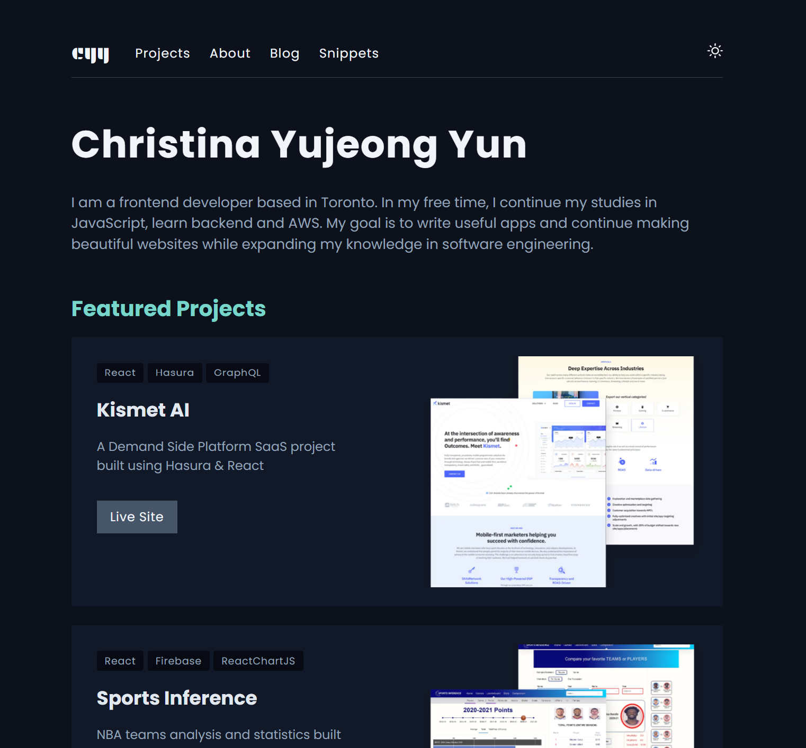

<!-- PROJECT LOGO -->
<div align="center">
   <a href="https://www.gatsbyjs.com/?utm_source=starter&utm_medium=readme&utm_campaign=minimal-starter-ts">
    
  </a>

  <h1 align="center">
  christinayun.dev - v1
  </h1>

  <p align="center">
   This project is built with Gatsby and TypeScript
    <br />
    <a href="https://christina.dev">View Live</a>
  </p>
</div>



<!-- GETTING STARTED -->

## 🚀 Getting Started

### Prerequisites

1. **NPM**

   ```shell
   npm install npm@latest -g
   ```

### Installation

1. **Clone the repo.**

   ```sh
   https://github.com/yjcyun/christinayun.dev.git
   ```

2. **Start developing.**

   Navigate into your new site’s directory and start it up.

   ```shell
   cd christinayun.dev/
   npm install
   npm run develop
   ```

3. **Open the code and start customizing!**

   Site is now running at http://localhost:8000!

<!-- ROADMAP -->

## 🚧 Roadmap

- [ ] Add SEO keywords to blog template
- [ ] Add SEO twitter image
- [ ] Add park blog
- [ ] Refactor card components
- [ ] Add banner image in About page
