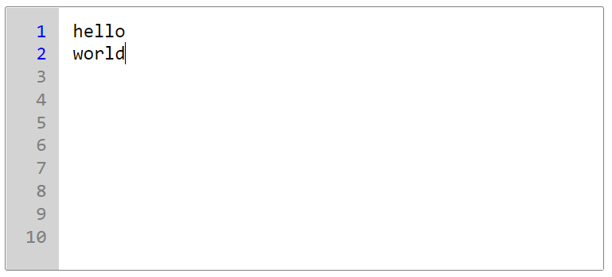

This article demonstrates how to create a re-usuable custom textarea component in React with line numbers. I used TypeScript and Styled-Components but feel free to use whichever tools you're comfortable with. A complete code can be found in this <a href='https://codesandbox.io/s/numbered-textarea-react-kfe4lq'>CodeSandbox</a>.

<br />



<br />
<br />

### Step 1: Create controlled textarea

If you wish control the value outside of the component, pass in `value` and `onValueChange` as props.

```tsx
type TextareaProps = {
  value: string;
  onValueChange: (value: string) => void;
  placeholder?: string;
  name?: string;
};

export const Textarea = ({
  value,
  onValueChange,
  placeholder,
  name,
}: TextareaProps) => {
  const handleTextareaChange = (
    event: React.ChangeEvent<HTMLTextAreaElement>
  ) => {
    onValueChange(event.target.value);
  };

  return (
    <textarea
      name={name}
      onChange={handleTextareaChange}
      placeholder={placeholder}
      value={value}
      wrap="off"
    />
  );
};
```

<br />

### Step 2: Add numbers to each line

Here comes the challenging part of this component. I want to add `numOfLines` as props so this component remains as reusuable and as flexible as possible. I then want to convert `numOfLines` into an array so it can iterate and render on the UI.

<br />

I used `useMemo` to count the number of lines in `value` and to create an array because this component will constantly re-render as user types into the textarea. By using `useMemo`, the function will only execute when the dependencies change.

<br />

The newly created array (`linesArr`) should watch for `lineCount` and be added to the array as user adds line breaks.

```tsx
type TextareaProps = {
  // ... previous props
  numOfLines: number;
};

export const Textarea = ({
  // ... previous props
  numOfLines,
}: TextareaProps) => {
  // count the number of lines in `value`
  const lineCount = useMemo(() => value.split("\n").length, [value]);
  // create array
  const linesArr = useMemo(
    () =>
      Array.from({ length: Math.max(numOfLines, lineCount) }, (_, i) => i + 1),
    [lineCount, numOfLines]
  );

  return (
    <div>
      <div>
        {linesArr.map((count) => (
          <div key={count}>{count}</div>
        ))}
      </div>
      <textarea />
    </div>
  );
};
```

<br />

### Step 3: Style the components

```tsx
const StyledTextareaWrapper = styled.div`
  border: 1px solid grey;
  border-radius: 2px;
  width: 500px;
  height: 220px;
`;

const sharedStyle = css`
  margin: 0;
  padding: 10px 0;
  height: 200px;
  border-radius: 0;
  resize: none;
  outline: none;
  font-family: monospace;
  font-size: 16px;
  line-height: 1.2;
  &:focus-visible {
    outline: none;
  }
`;

const StyledTextarea = styled.textarea`
  ${sharedStyle};
  padding-left: 3.5rem;
  width: calc(100% - 3.5rem);
  border: none;
  &::placeholder {
    color: grey;
  }
`;

const StyledNumbers = styled.div`
  ${sharedStyle};
  display: flex;
  flex-direction: column;
  overflow-y: hidden;
  text-align: right;
  box-shadow: none;
  position: absolute;
  color: grey;
  border: none;
  background-color: lightgrey;
  padding: 10px;
  width: 1.5rem;
`;

// ...
export const Textarea = ({}: TextareaProps) => {
  // ...
  return (
    <StyledTextareaWrapper>
      <StyledNumbers>
        {linesArr.map((count) => (
          <div key={count}>{count}</div>
        ))}
      </StyledNumbers>
      <StyledTextarea />
    </StyledTextareaWrapper>
  );
};
```

<br />

### Step 4: Synchronize the position of textarea and the numbers wrapper on scroll

What I want to achieve in this step is when `<StyledTextarea />` scrolls, `<StyledNumbers />` scrolls simultaneously. To acheive this, I make use of `useRef`. Here's the implementation:

```typescript
// 1. Define refs
const lineCounterRef = useRef<HTMLDivElement>(null);
const textareaRef = useRef<HTMLTextAreaElement>(null);

// 3. Add onScroll handler
const handleTextareaScroll = () => {
  if (lineCounterRef.current && textareaRef.current) {
    lineCounterRef.current.scrollTop = textareaRef.current.scrollTop;
  }
};

// 2. Place refs in components
return (
  <StyledTextareaWrapper>
    <StyledNumbers ref={lineCounterRef}>
      {linesArr.map((count) => (
        <div key={count}>{count}</div>
      ))}
    </StyledNumbers>
    <StyledTextarea ref={textareaRef} onScroll={handleTextareaScroll} />
  </StyledTextareaWrapper>
);
```

<br />

### Final Code

```tsx
import React, { useMemo, useRef } from "react";
import styled, { css } from "styled-components";

type TextareaProps = {
  value: string;
  numOfLines: number;
  onValueChange: (value: string) => void;
  placeholder?: string;
  name?: string;
};

const StyledTextareaWrapper = styled.div`
  border: 1px solid grey;
  border-radius: 2px;
  width: 500px;
  height: 220px;
`;

const sharedStyle = css`
  margin: 0;
  padding: 10px 0;
  height: 200px;
  border-radius: 0;
  resize: none;
  outline: none;
  font-family: monospace;
  font-size: 16px;
  line-height: 1.2;
  &:focus-visible {
    outline: none;
  }
`;

const StyledTextarea = styled.textarea`
  ${sharedStyle}
  padding-left: 3.5rem;
  width: calc(100% - 3.5rem);
  border: none;
  &::placeholder {
    color: grey;
  }
`;

const StyledNumbers = styled.div`
  ${sharedStyle}
  display: flex;
  flex-direction: column;
  overflow-y: hidden;
  text-align: right;
  box-shadow: none;
  position: absolute;
  color: grey;
  border: none;
  background-color: lightgrey;
  padding: 10px;
  width: 1.5rem;
`;

const StyledNumber = styled.div<{ active: boolean }>`
  color: ${(props) => (props.active ? "blue" : "inherit")};
`;

export const Textarea = ({
  value,
  numOfLines,
  onValueChange,
  placeholder = "Enter Message",
  name,
}: TextareaProps) => {
  const lineCount = useMemo(() => value.split("\n").length, [value]);
  const linesArr = useMemo(
    () =>
      Array.from({ length: Math.max(numOfLines, lineCount) }, (_, i) => i + 1),
    [lineCount, numOfLines]
  );

  const lineCounterRef = useRef<HTMLDivElement>(null);
  const textareaRef = useRef<HTMLTextAreaElement>(null);

  const handleTextareaChange = (
    event: React.ChangeEvent<HTMLTextAreaElement>
  ) => {
    onValueChange(event.target.value);
  };

  const handleTextareaScroll = () => {
    if (lineCounterRef.current && textareaRef.current) {
      lineCounterRef.current.scrollTop = textareaRef.current.scrollTop;
    }
  };

  return (
    <StyledTextareaWrapper>
      <StyledNumbers ref={lineCounterRef}>
        {linesArr.map((count) => (
          <StyledNumber active={count <= lineCount} key={count}>
            {count}
          </StyledNumber>
        ))}
      </StyledNumbers>
      <StyledTextarea
        name={name}
        onChange={handleTextareaChange}
        onScroll={handleTextareaScroll}
        placeholder={placeholder}
        ref={textareaRef}
        value={value}
        wrap="off"
      />
    </StyledTextareaWrapper>
  );
};
```

<br />

### Using this component

```tsx
import React, { useState } from "react";
import { Textarea } from "./Textarea";

export default function App() {
  const [value, setValue] = useState("");

  return (
    <div>
      <Textarea
        name="test-textarea"
        value={value}
        onValueChange={(value: string) => setValue(value)}
        numOfLines={10}
      />
    </div>
  );
}
```
